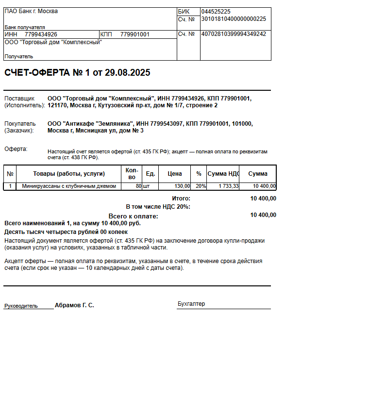

# Счет-оферта для 1С:Бухгалтерии

Демо-проект [Конвейера 1С](https://gitsell.ru/1c): небольшая идея из практики 1С превращена в готовое расширение с открытым исходным кодом.

Расширение добавляет в **1С:Бухгалтерию предприятия 3.0** отдельную печатную форму **"Счет-оферта"** для документа **"Счет на оплату покупателю"**. Это удобно для разовых продаж, когда отдельный договор не нужен, а счет должен сразу содержать условия оферты и акцепта.

## Зачем Это Нужно

В типовом сценарии менеджер выставляет счет, клиент оплачивает, а юридическая часть часто остается "за кадром": был ли договор, на каких условиях клиент согласился оплатить, что именно считается акцептом.

Счет-оферта закрывает этот разрыв простым способом: в привычной печатной форме счета появляется текст оферты. Клиент получает один документ, где есть реквизиты оплаты, товары или услуги, итоговая сумма и условия принятия предложения.

## Что Получает Пользователь

- Новую команду печати **"Счет-оферта"** в документе счета покупателю.
- Отдельную печатную форму, которая не ломает и не заменяет типовой счет.
- Готовый текст оферты и акцепта по ст. 435 и 438 ГК РФ.
- Обычную табличную часть счета: товары, количество, цена, НДС, итоги.
- Редактируемый MXL-макет: можно вручную поменять текст условий, подписи и оформление под стиль компании.

## Что Показывает Этот Репозиторий

Это не просто пример кода. Это маленький публичный кейс о том, как может выглядеть современная разработка для 1С:

- идея оформлена как понятная пользовательская функция;
- доработка сделана расширением, без изменения основной конфигурации;
- результат проверен в демо-базе;
- исходники лежат в GitHub и могут быть изучены, переиспользованы или доработаны;
- техническая история проекта сохранена рядом с кодом.

[Конвейер 1С](https://gitsell.ru/1c) нужен именно для таких задач: быстро собрать полезную доработку, оставить после нее чистый инженерный след и показать результат не только в базе, но и в репозитории.

## Как Это Выглядит В 1С

В счете покупателю в меню **Печать** появляется отдельный пункт:

```text
Счет-оферта
```

В печатной форме есть заголовок `СЧЕТ-ОФЕРТА`, реквизиты поставщика и покупателя, табличная часть, сумма к оплате и текст:

```text
Настоящий счет является офертой...
Акцепт - полная оплата по реквизитам счета...
```

Текст дополнительных условий зафиксирован прямо в MXL-макете, поэтому его можно изменить штатным редактированием макета без доработки кода расширения.

## Пример Печатной Формы



Файлы примера сформированы из демо-документа:

- [HTML](docs/examples/schet-oferta.html)
- [Excel](docs/examples/schet-oferta.xlsx)
- [PNG-превью](docs/examples/schet-oferta.png)

## Проверка

Печатная форма проверена через тестовый HTTP bridge в демо-базе.

Проверка подтвердила, что форма:

- формируется сервером 1С;
- содержит заголовок `СЧЕТ-ОФЕРТА`;
- содержит текст оферты и акцепта;
- выводит табличную часть и итог к оплате.

Технический отчет о проверке, составе расширения и точках подключения вынесен в [docs/TECHNICAL.md](docs/TECHNICAL.md).

## Сборка CFE

Готовый файл расширения лежит в [dist/ГСК_СчетОферта.cfe](dist/ГСК_СчетОферта.cfe).

Для быстрой пересборки из XML-исходников используется Python-скрипт:

```powershell
python scripts/build_cfe.py --server "<сервер 1С>" --ref "<имя базы>" --user "<пользователь>"
```

Скрипт загружает исходники из `src` в расширение и выгружает свежий `.cfe` в каталог `dist`.

## Для Кого Этот Пример

Для пользователей 1С, которым нужна быстрая прикладная доработка без большого проекта внедрения.

Для разработчиков 1С, которым интересно посмотреть на минимальное расширение с печатной формой, MXL-макетом и проверкой результата.

Для команд, которые хотят выкладывать 1С-проекты публично: с понятным README, кодом, документацией и воспроизводимой проверкой.

## Ссылки

- [Конвейер 1С](https://gitsell.ru/1c)
- [Техническое описание](docs/TECHNICAL.md)
- [Состав заимствования](docs/BORROW.md)
- [План реализации](docs/IMPLEMENTATION.md)
- [Исходники расширения](src)
